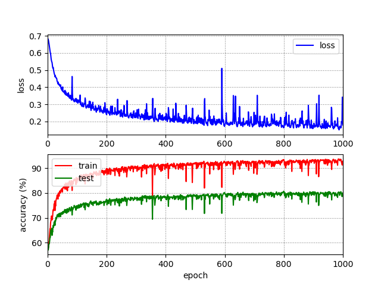
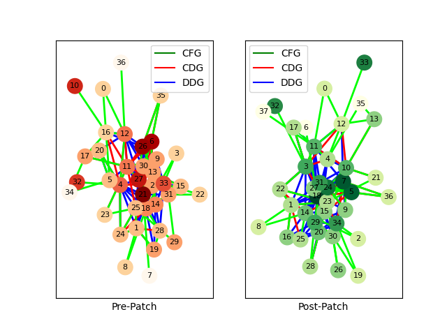
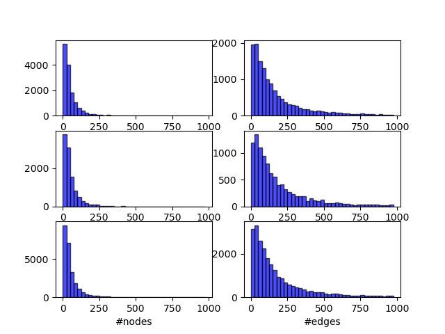

# BinGo
**BinGo** is an end-to-end security patch detection system over binary code. **BinGo** can be used to distinguish secure and non-secure patches in binary code. Its main idea is to present the code as code property graphs to enable a comprehensive understanding of program flow and catch the instruction semantics. **BinGo** consists of four phases, namely, patch data pre-processing, graph extraction, embedding generation, and graph representation learning. Our work has been accepted by `AsiaCCS 2024`.

## Installation and Dependencies

```bash
conda create -n pytorch_cu117 python=3.9
conda install pytorch torchvision torchaudio pytorch-cuda=11.7 -c pytorch -c nvidia
conda install pyg -c pyg
conda install pandas matplotlib networkx natsort
```

## Data Preprocessing

## Model Training

## Basic Analysis

All operations are performed under the root path.

1. Plot Training Curve.

```bash
python analysis/plot_train_curve.py -log <path-to-training-log>.txt
```

The results are saved in the same path and the same filename with `.png`.



2. Plot Graph Structure.

```bash
python analysis/plot_graph.py -npz <path-to-npz-graph-file>.npz
```

The results are saved in the `./temp/` with a `.txt` file (records) and a `.png` file (visualization).



3. Plot Graph Statistic.

```bash
python analysis/plot_graph_dist.py
```

The results are saved in the `./temp/records.csv` and `./temp/records.png`.



## Citation
```
@misc{he2023bingo,
      title={BinGo: Identifying Security Patches in Binary Code with Graph Representation Learning}, 
      author={Xu He and Shu Wang and Pengbin Feng and Xinda Wang and Shiyu Sun and Qi Li and Kun Sun},
      year={2023},
      eprint={2312.07921},
      archivePrefix={arXiv},
      primaryClass={cs.CR}
}
```
